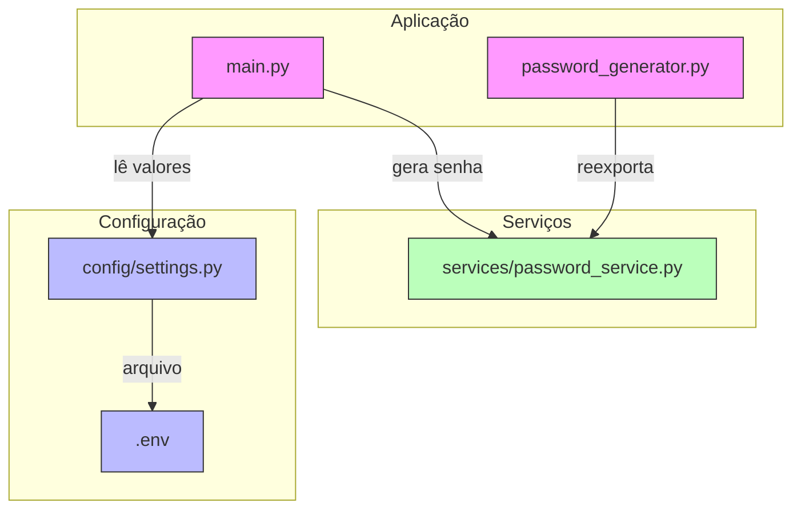

# Diagrama de Arquitetura

```mermaid
flowchart TD
    subgraph App[Aplicação]
        Main[main.py]
        PasswordGenerator[password_generator.py]
    end

    subgraph Config[Configuração]
        Settings[config/settings.py]
        EnvFile[.env]
    end

    subgraph Services[Serviços]
        PasswordService[services/password_service.py]
    end

    Main -->|lê valores| Settings
    Settings -->|arquivo| EnvFile
    Main -->|gera senha| PasswordService
    PasswordGenerator -->|reexporta| PasswordService

    classDef app fill:#f9f,stroke:#333,stroke-width:1px;
    classDef config fill:#bbf,stroke:#333,stroke-width:1px;
    classDef service fill:#bfb,stroke:#333,stroke-width:1px;

    class Main,PasswordGenerator app
    class Settings,EnvFile config
    class PasswordService service
```