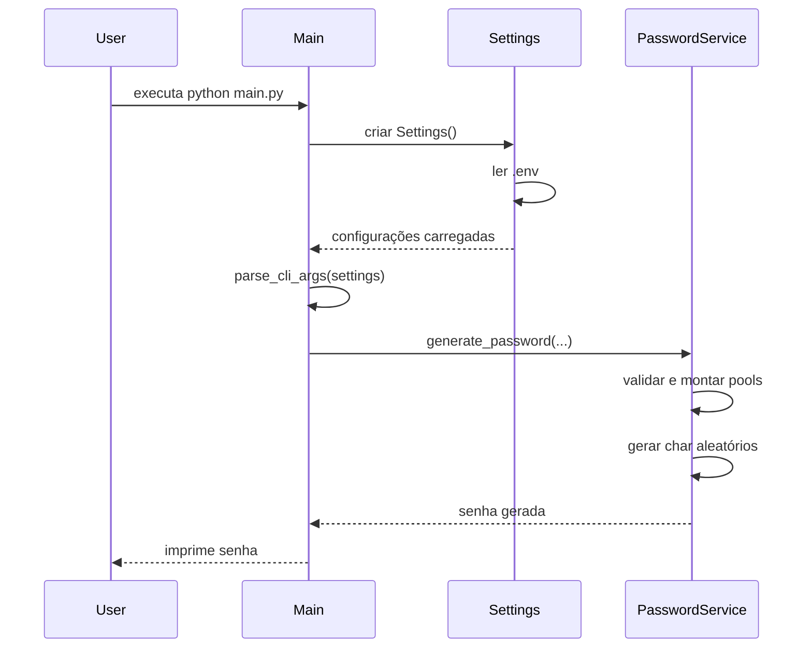

# Diagrama de Sequência

```mermaid
sequenceDiagram
    participant User
    participant Main
    participant Settings
    participant PasswordService

    User->>Main: executa python main.py
    Main->>Settings: criar Settings()
    Settings->>Settings: ler .env
    Settings-->>Main: configurações carregadas
    Main->>Main: parse_cli_args(settings)
    Main->>PasswordService: generate_password(...)
    PasswordService->>PasswordService: validar e montar pools
    PasswordService->>PasswordService: gerar char aleatórios
    PasswordService-->>Main: senha gerada
    Main-->>User: imprime senha
```